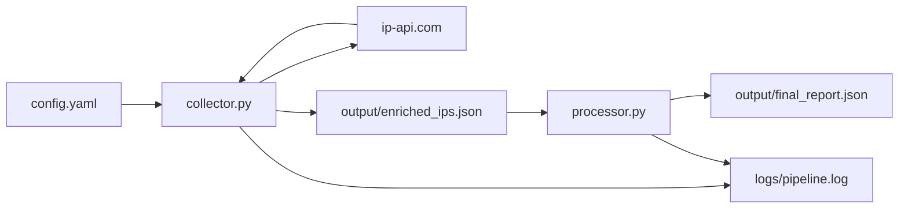

# Arquitetura

## Descrição

O pipeline começa lendo o arquivo `config.yaml`, onde ficam a lista de IPs, timeout, quantidade de tentativas e diretórios de saída.

O `collector.py` consulta a API pública `ip-api.com` para enriquecer cada IP. Depois ele salva os dados brutos enriquecidos em `output/enriched_ips.json`.

O `processor.py` lê esse arquivo, aplica uma classificação simples para cada IP e gera o relatório final em `output/final_report.json`.
